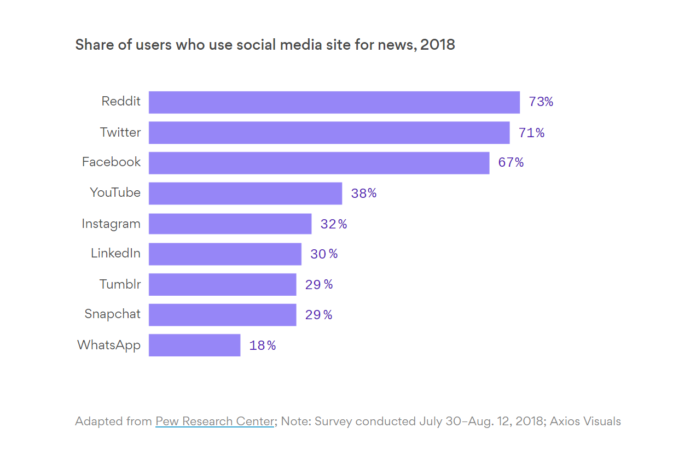

## Tracking Social and Political Movements

Shashank Bharadwaj, Andres Crucetta Nieto, and Beau Smit

## Social Science Question

Understanding political and social sentiments of the population can be useful for intelligence agencies and policymakers alike. Having a pulse on public opinion informs policy and helps identify which individuals and organizations are involved with the associated movements. Thus, we have designed our project to gain perspective on how political movements have developed over the decades. 

We extracted data from the NY Times API, Google Books, and Reddit to measure the number of times keywords such as “nationalism” and “socialism” have occurred year over year. Additionally, we built a real-time tracking tool that gathers live data from Reddit so that the current era can be compared with the historical context of each of these movements.

From all the social and political movements, we selected those with the most impact on peoples’ lives over the last century. We also include movements that are intriguing or nascent. Table 1 identifies all movements that we track as well as their associated keywords.

**Table 1:** Selected Political Movements along with their Key Terms


<table>
  <tr>
   <td><strong>Movement</strong>
   </td>
   <td><strong>Key Terms</strong>
   </td>
  </tr>
  <tr>
   <td>Nationalism
   </td>
   <td>nationalist, nationalism
   </td>
  </tr>
  <tr>
   <td>Communism
   </td>
   <td>communist, communism
   </td>
  </tr>
  <tr>
   <td>Fascism
   </td>
   <td>fascist, fascism
   </td>
  </tr>
  <tr>
   <td>Liberalism
   </td>
   <td>liberal, liberalism
   </td>
  </tr>
  <tr>
   <td>Conservatism
   </td>
   <td>convervative, conservatism
   </td>
  </tr>
  <tr>
   <td>Authoritarianism
   </td>
   <td>authoritarian, authoritarianism
   </td>
  </tr>
  <tr>
   <td>Populism
   </td>
   <td>populist, populism
   </td>
  </tr>
  <tr>
   <td>Progressivism
   </td>
   <td>progressive, progressivism
   </td>
  </tr>
  <tr>
   <td>QAnon
   </td>
   <td>qanon
   </td>
  </tr>
  <tr>
   <td>Libertarianism
   </td>
   <td>libertarian, libertarianism
   </td>
  </tr>
  <tr>
   <td>Marxism
   </td>
   <td>marxist, marxism
   </td>
  </tr>
  <tr>
   <td>Neoliberalism
   </td>
   <td>neoliberal, neoliberalism
   </td>
  </tr>
</table>


### Data

Our corpus for the NLP analysis includes Google Books text and news articles from The New York Times. We include a real-time streaming component that displays the volume of discussion for the selected movements within selected Reddit communities. 

**Google Books**

This dataset is available in the AWS Open Data registry. It contains words extracted from the Google Books corpus and proved useful for identifying movements that were commonly written about and published in books.

We used n-grams to break down the text. The n specifies the number of elements in each tuple, so a 5-gram contains five words that were located next to each other in the original text. These n-grams were produced by passing a sliding window over the complete text and outputting a record for each n-gram.

**<span style="text-decoration:underline;">Example:</span>**

“The yellow dog played fetch.”

**Produces the following 2-grams:**

["The", "yellow"]

["yellow", 'dog"]

["dog", "played"]

["played", "fetch"]

["fetch", "."] 

The values in this dataset were:


* N-gram: the set of words for each n-gram
* Year: the year for this aggregation
* occurrences - The number of times this n-gram appeared in this year

Datasets were available in many languages, but we chose American English - eng-us-all for the 1 n-gram. It had 291M rows and its compressed size was 3 GB.

**The New York Times**

This dataset is available through the [New York Times Archive API](https://developer.nytimes.com/docs/archive-product/1/overview). Given a month and year, the API returns a JSON object with information about all of the articles in that month. For each article, the object contains the article headline, abstract, and the lead paragraph, among other things (see Appendix 1 for an example).

The data in the API goes back to 1891 but we look at the years from 2010-2020.**<span style="text-decoration:underline;"> </span>**We were hoping to be able to hit the NYT API in parallel, however we were quickly hit with rate limitations as the API only allowed 10 calls per minute. Thus we were forced to introduce a time.sleep(6) line to the code between each call. Overall, we hit the API for each political movement (13) for each year (11 years from 2010-2021) and each month within that year (13*11*12 = 1716 total calls).

**Reddit**

Reddit is a social media platform that has become popular in recent years. It is useful for our analysis because many of the users engage with Reddit for obtaining news.

**Figure 1**: Proportion of members using social media for news


Data from Reddit is available through their [API](https://www.reddit.com/dev/api/), but we used a Python implementation called [PRAW](https://praw.readthedocs.io/en/stable/). The API has many features including searching for the newest posts or the “hottest[^1]” posts. It also allows querying all of Reddit or just specific subreddits[^2]. The query response object includes information about the submission such as author, title, time, and date. The API has limitations as it does not permit searching over specific time windows and can only fetch 100 posts per query.

## Large Scale Methods

**Google Books**

Spark proved useful for analyzing the Google Books 1-ngram 3GB dataset. We extracted it from the AWS bucket using PySpark’s read methods: “sc.sequenceFile(“AWS Bucket Address”)”

We then used components from Map Reduce to split each file and create a RDD dataframe. This data frame includes a row containing the ngram, the year it occurred, and the number of times it occurred.

Having built the RDD dataframe, we filtered the data using the RDD filter method: “df.filter(lambda x: x[‘year’]>1945” to select a subset of the years we were interested in. Additionally, we filtered down to the list of key terms within each political movement. Drastically reducing the scale of our data.

Finally we converted the RDD dataframe into a Spark dataframe and created a view for it using PySpark SQL’s method: “df.createOrReplaceTempView(“df”)”. This allowed us to create a custom SQL statement where we grouped by ngram and year, obtaining our final CSV file.

**The New York Times**

We use Amazon EMR with PySpark to run our script to both hit the NYT API and process the results, including using PySpark NLP. 

For each document returned in the JSON, our code checks the abstract, snippet, and lead paragraph to see if it includes any of our key terms:

               **if** (any(x **in** abstract **for** x **in** key_terms) **or** any(x **in** snippet **for** x **in** key_terms) **or** any(x **in** lead_para **for** x **in** key_terms)):

                    p_cnt **+=** 1

                    abstracts**.**append([doc['abstract']])

If so, we count one mention and save the abstract of the article for use with PySpark NLP.

We were really able to take advantage of parallelism in our processing once we got to using PySpark NLP to perform Named Entity Recognition (NER). We converted our list of relevant abstracts for each movement into a Spark dataframe and used the 'explain_document_dl' PretrainedPipeline to perform the text analysis. Then we used NER by filtering to lemmas with the label ‘B-PER’ or ‘I-PER’ to restrict to identifying people. After obtaining the count of mentions per person, we converted the dataframe to Pandas. This made it easier to write the dataframe to .csv in S3.

**Reddit**

For each subreddit, we wanted to find words associated with each political movement. Instead of serially making queries to each subreddit for each word, we parallelized the process using AWS Lambda to improve scalability. Thus, each worker takes the key term(s) from a particular political movement and searches for the term(s) within a single subreddit. If we are interested in 8 different subreddits for our 13 political movements, we will have 104 (8*13) workers performing queries simultaneously. Finally, once the workers have completed the query, they report how many times the subreddit mentioned the key terms. This will allow for extremely reduced query times so that the data stream can be updated in shorter time intervals.

We set up a data stream from the Reddit API to AWS Kinesis. The producer of the stream queries the Reddit API in parallel using AWS Lambda to retrieve the counts of keyword mentions. The results from each subreddit are summed together before going into the stream. The consumer of the stream will see the total number of times each political movement was mentioned since the last call to the API. Since the queries take longer than microseconds, it may be overkill to set up a stream; however, we could set up asynchronous calls to Lambda, which would increase the need for throughput. Regardless, implementation is both scalable and inexpensive.

### Results

**Google Books**

This dataset proved useful for identifying movements that were commonly written about and published in books.

As seen in the chart below, socialism peaked during the 1960’s facing a decline thereafter, while nationalism and progressivism have been on the rise since the 1990’s. 

**Figure 2:** Number of Times a Movement Occurred in Google Books


**The New York Times**

Below are a couple of charts generated from the count data from the New York Times.


**Figure 3:** Mentions in NYT Articles By Movement


We can see that Conservatism and Liberalism are the most mentioned movements, but the mentions of Conservatism have dropped over time while the mentions for Liberalism have stayed relatively steady. We cannot tell as much about some of the less-mentioned movements, so we remove the top two and plot again to be able to see them better.


**Figure 4:** Mentions in NYT Articles By Movement 

_(Excluding Conservatism and Liberalism)_


Here we can see some interesting trends - we can see, for example, that Communism had a strong wave of mentions in the early 2010s before dropping down more recently. We can see Progressivism take off starting around 2017. Lastly, we see QAnon emerge in 2019 from no mentions to moving above Marxism, Libertarianism, and Fascism.

With the NER data, we were interested to see which people were associated with each political movement and if it matched our expectations. The table below shows a sample of the most mentioned lemmas for selected movements (as examples):

**Table 2:** People Associated with each Movement using Named Entity Recognition


We can see names that align with the movements across the spectrum, from Belarus dictator Aleksandr Lukashenko under Authoritarianism, to Xi Jinping under Communism, Bernie Sanders under Progressivism, and Marjorie Taylor Greene associated with QAnon. This indicates that the model output aligns with our expectations.

**Reddit**

The Kinesis stream outputs the number of all mentions for each political movement summed across all subreddits searched. For the following example, we use Lambda to query 100 of the most recent posts from subreddits r/World News, r/Politics, r/Progressive, r/Conservative, and several others. Figure 5 shows the output from the consumer.py file.

**Figure 5:** Reddit streaming output


For the particular time this stream was run, Libertarianism and Conservatism were the most discussed topics. For a breakdown by number of mentions per subreddit, please see Appendix 3. The number of mentions do not change very quickly because each subreddit has few submissions per minute. Thus, streaming may not be required for this application. However, it may be useful to run this application every 30 minutes or so and then save the results into a database. Eventually, we could look back at the trend and we would have theoretically accounted for every submission that ever posted to each subreddit. Ultimately, this application can be a useful resource for pinpointing when certain movements gain traction and for how long they dominate the headlines.


## Citations

1. Google Books Ngrams was accessed on 12/06/2021 from [https://registry.opendata.aws/google-ngrams](https://registry.opendata.aws/google-ngrams).
2. NYT Archive API

    [https://developer.nytimes.com/docs/archive-product/1/overview](https://developer.nytimes.com/docs/archive-product/1/overview)

3. Spark NLP - John Snow Labs

    [https://nlp.johnsnowlabs.com/](https://nlp.johnsnowlabs.com/)

4. PRAW (The Python Reddit API Wrapper)

    [https://praw.readthedocs.io/en/stable/](https://praw.readthedocs.io/en/stable/)

## Appendix

**Appendix 1:** Example of a (trimmed) doc response from NYT API JSON Response Object

{"abstract":"Congress could do much more to protect Americans who have served their country from predatory for-profit colleges.","web_url":"https://www.nytimes.com/2019/12/31/opinion/for-profit-college-veterans.html","snippet":"Congress could do much more to protect Americans who have served their country from predatory for-profit colleges.","lead_paragraph":"Congress invited predatory for-profit colleges to defraud military veterans when it wrote a loophole into the rules governing federal education aid. The loophole, added to the Higher Education Act in 1998, encouraged the schools to take the education aid of Americans who had served the country while giving them valueless degrees — or no degrees at all — in return.","headline":{"main":"Protect Veterans From Fraud"}

**Appendix 2:** PySpark code to extract Google Books data from AWS Open Registry

```
s3 = boto3.resource('s3')
aws_bucket = s3.Bucket('datasets.elasticmapreduce')

for my_bucket_object in aws_bucket.objects.filter(Prefix='ngrams/books/20090715/eng-us-all/1gram/data'):
   print(my_bucket_object)
   words_obj = my_bucket_object

def mapper(line):
   fields= line.split("\t")
   return Row(ngram=str(fields[0].lower()),
              year=int(fields[1]),
              occur=int(fields[2]))

lines = sc.sequenceFile("s3://datasets.elasticmapreduce/ngrams/books/20090715/eng-us-all/1gram/data")
stringlines=lines.map(lambda x: x[1])
gramsdf = stringlines.map(mapper)

Sample Output: [Row(ngram='#', occur=3635, year=1945), Row(ngram='#', occur=5684, year=1946)]

#Create data frame and table to query
df = spark.createDataFrame(filtered_words).cache()
df.createOrReplaceTempView("df")

#Query for top terms in each year
test_words = sqlContext.sql('''SELECT ngram, year, sum(occur) as occur
                    FROM df
                    GROUP BY ngram, year
                    ORDER BY occur DESC''')

Example Output:
+------------+----+------+
|       ngram|year| occur|
+------------+----+------+
|   communist|1967|150261|
|   communist|1968|124917|
|   communist|1965|121710|
```

**Appendix 3:** Reddit Movement hits broken down by subreddit


Even though Libertarian is the most frequently referenced term, all references came from the r/Libertarian subreddit. Interestingly, the conservatism movement is discussed in many different subreddits.

**Appendix 4:** How the work was divided amongst group members

Each member of the group was responsible for a different component of data gathering, processing, and analysis. Each task was separate but fed into our overall goal of analyzing political movements. All members wrote up their own results and contributed to the README document. Andres was responsible for the Google Books analysis, Shashank was responsible for the New York Times analysis, and Beau was responsible for the Reddit analysis.
